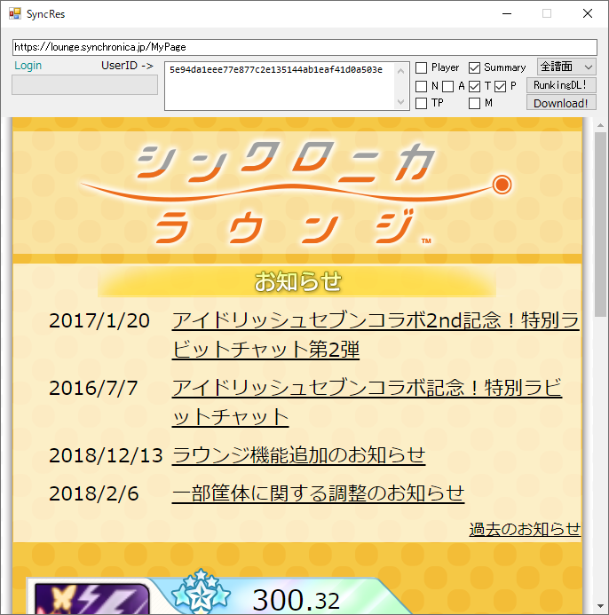

# SyncRes
リザルトやランキングを一括取得する
[]

# 使い方
1. 上の releases からexeをダウンロードして実行
2. 画面下部のブラウザでログインする
3. 画面上部の設定をいじる
	* UserID: 取得したいプレイヤーのIDを行ごとに書く
	* Player, Detail, ..., M: 取得したい情報を選ぶ
		| チェックボックス | 情報 |
		|:---:|:---|
		| Player | 各プレイヤーの情報 (名前、称号、レート、クラウン数など) |
		| Detail | やりこみ情報 (総Rz数など) __[注意]先頭のIDのみの情報を出します__ |
		| N, A, T, P | 各難易度の情報 (プレイ回数、CRなど) |
		| TP | Pndのある曲はP、ない曲はT |
		| M | マルチプレイの情報(ベストコンボ、相方情報など) |
	* サヨナラ除外: サヨナラ曲の情報を出力しない
	* Fast: 一人目で除外された(サヨナラ/存在しない曲ID/未プレイ)曲の情報を二人目以降で読み込まない
	* MusicIDMax: 曲IDの最大値(現状、基本いじらなくていい。イノうた入れるなら401にする)
4. Download! か RankingDL! を押して一括取得する
	* Download! : 3で書いたとおりの情報を取得
	* RankingDL! : N/A/T/P/M のみ、UserID内のプレーヤーと同一ページにいるプレーヤーのIDを取得
5. ダウンロード成功するとフォルダに `*.csv` ファイルができるので、Excelとかで開く

# 注意
* 多分セキュリティソフトとかがうるさいだろうけど頑張って()
	* ソースコードから自分でビルド(コンパイル)すれば多少ましになると思う
* ブラウザが止まることが多いけどその時は諦めて再起動して
	* 割と序盤(最初とかログイン画面とか辺り)でこけることが多いからDL中は割と頑張ってくれる(無保証)

# 使ってるライブラリとか
* CefSharp `Copyright © 2010-2018 The CefSharp Authors. All rights reserved.`
